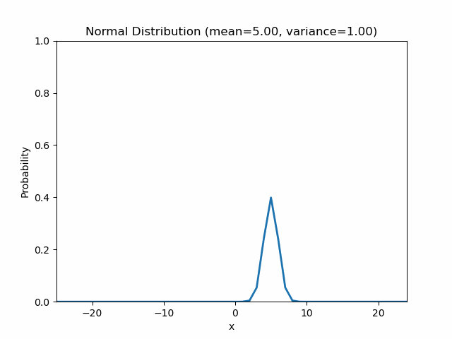
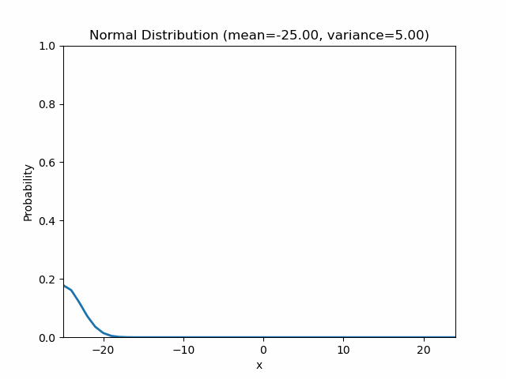

# python implementation to learn statistics

## Visualize Distribution
- binominal distribution
```
python3 prob_distribution/binominal_distribution.py --n 30 --probability 0.5
```
.png)
- normal distribution
```
python3 prob_distribution/normal_distribution.py --mean 0.0 --variance 10.0
python3 prob_distribution/normal_distribution_animation.py --mean 5.0 # animation that variance will be changing
python3 prob_distribution/normal_distribution_animation.py --variance 10.0 # animation that mean will be changing
```
.png)

