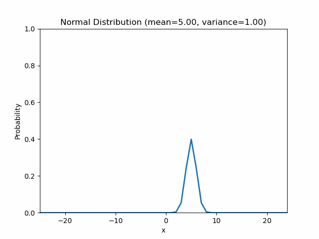
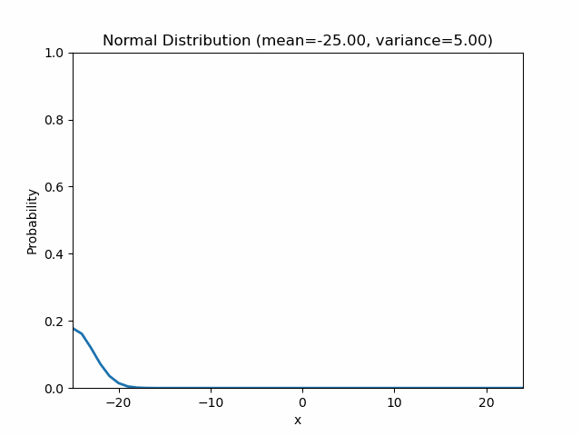

# Probabilistic Distribution

## Bernoulli trial
**Bernoulli trial** is a trial that one of the two, true or false, happens.
e.g. front or back of coin, any number or others of dice

## Binomial distribution
**Binomial distribution** is a distribution that n(>1) Bernoulli trials follow.
When n = 1, it is Bernoulli distribution.
The mean is **np** and the variance is **np(1-p)**.

**Combination** and **Binomial distribution** are defined by
$$
{}_n\mathrm{C}_x = \frac{n!}{(n-x)!x!}
$$
$$
P(x) = {}_n\mathrm{C}_xp^x(1-p)^{n-x}
$$
, where $p$ is the probability of occurrence, $n$ is the number of Bernoulli trials, and $x$ is the number of occurrence.

```
python3 prob_distribution/binominal_distribution.py --n 30 --probability 0.5
```
.png)

## Normal(Gaussian) distribution
**Normal(Gaussian) distribution** is Binomial distribution when $n \rightarrow \infin$, which is defined by
$$
f(x) = N(\mu, \sigma^2) = \frac{1}{\sqrt{2\pi\sigma^2}}e^{\frac{-(x-\mu)^2}{2\sigma^2}}
$$
, where $\sigma^2$ is the variance and $\mu$ is the mean. 
This is normalized so that $\int^{\infin}_{-\infin}f(x)dx$ takes 1 to express probability.
Hight, weight, and power of human, natural phenomena, marriage, and a great deal of things follows a normal distribution. Therefore, normal distribution is used for a prerequisite of most statistics. 68%, 95%, and 99% of the data lie within $1\sigma$, $2\sigma$, and $3\sigma$ respectively.

Property
1. **Central Limit Theorem**, A large number of probability distributions follows normal distribution when the number of the samples. 
2. **Additivity**, A normal distribution plus a normal distribution is also a normal distribution if they are independent. 
$$
N(\mu_1, \sigma_1^2) + N(\mu_2, \sigma_2^2) = N(\mu_1 + \mu_2, \sigma_1^2 + \sigma_2^2)
$$
3. Continuous

```
python3 prob_distribution/normal_distribution.py --mean 0.0 --variance 10.0
python3 prob_distribution/normal_distribution_animation.py --mean 5.0 # animation that variance will be changing
python3 prob_distribution/normal_distribution_animation.py --variance 10.0 # animation that mean will be changing
```
.png)



## Poisson distribution
**Poisson distribution** is Binomial distribution when $n \rightarrow \infin$ and $p \rightarrow 0$, which is defined by
$$
P(x) = \frac{e^{-\lambda}\lambda^x}{x!}
$$
, where $\lambda$, $pn$, is the mean number of occurrences in a fixed interval, $x$ is the number of occurrences.
Both the mean and the variance are **np**.

Property
1. **Additivity**, A normal distribution plus a normal distribution is also a normal distribution if they are independent. 
$$
Poisson(\lambda_1) + Poisson(\lambda_2) = Poisson(\lambda_1 + \lambda_2)
$$
2. Discrete

```
python3 prob_distribution/poisson_distribution.py -x 15 -l 5
```
.png)